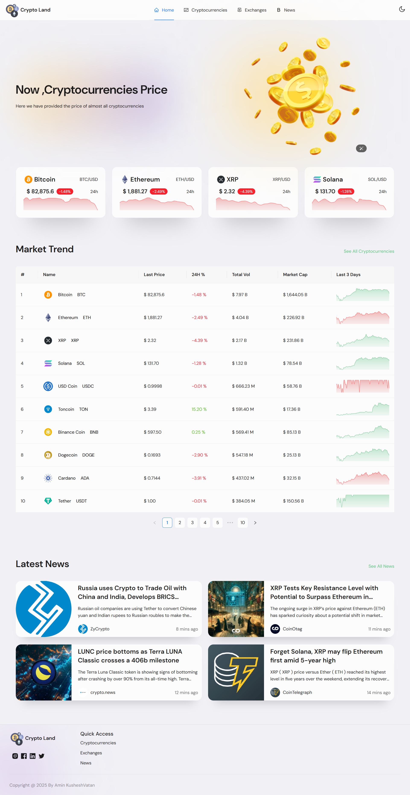
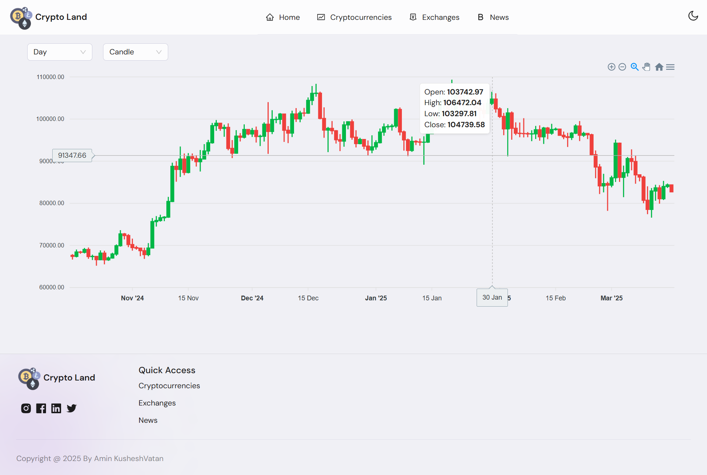

# Cryptocurrency Web Application

This project is a cryptocurrency web application built using React, Redux, Ant Design, and Recharts. It provides users with real-time information about cryptocurrencies, including live prices, market caps, and historical data. The application is deployed on Vercel and can be accessed at [https://cryptocurrency-web-two.vercel.app/](https://cryptocurrency-web-two.vercel.app/).

## Screenshots



## Features

- **Real-Time Cryptocurrency Data**: Live prices, market caps, and 24-hour changes are fetched from a cryptocurrency API.
- **Historical Data**: Visualize the historical price data of cryptocurrencies using interactive charts.
- **Dark Mode**: Toggle between light and dark themes for better user experience.
- **Responsive Design**: The application is fully responsive and works seamlessly on both desktop and mobile devices.

## Technologies Used

- **React**: A JavaScript library for building user interfaces.
- **Redux**: A state management library for managing global state in the application.
- **Redux RTK Query**: Redux Toolkit includes the RTK Query data fetching and caching API.
- **Ant Design**: A UI library for building elegant and responsive user interfaces.
- **Recharts**: A charting library built on React components for creating interactive charts.
- **Vite**: A fast build tool for modern web projects.

## Getting Project

* Clone the repository:*
```bash
git clone https://github.com/amin93k/React-Cryptocurrency-Web